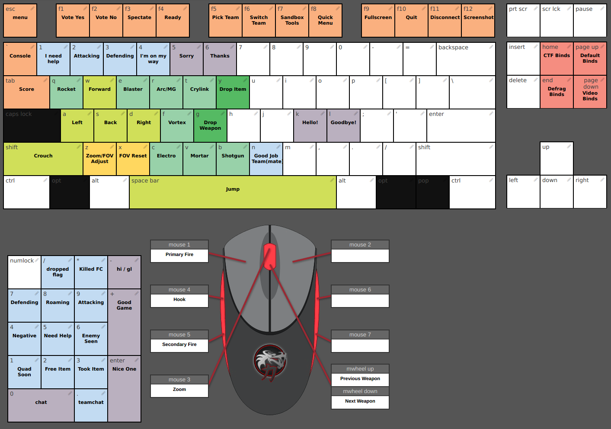

# xonotic-config.pk3dir

This repository contains a basic framework and some more detailed binds than the Xonotic defaults.



These are loosely visualized/editable at https://z.github.io/kbx *in progress*

## Usage

Clone this directory into your **gamedir** directory as specified below, and modify as you see fit.

```
git clone https://github.com/z/xonotic-config.pk3dir.git
```

or download the [latest zip](https://github.com/z/xonotic-config.pk3dir/archive/master.zip)


#### gamedir

|OS|Path|
|:--|:--|
|Windows|C:\Users\yourusername\Saved Games\xonotic\data|
|Linux|~/.xonotic/data|
|Mac|~/Library/Application Support/xonotic/data|

Nothing should *ever* be added to the main installation folder of Xonotic, use these paths!
